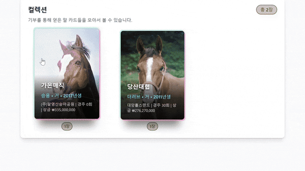

<div align="center"> 
  
</div>

## 🐎 마중
블록체인 기반 스마트 컨트랙트를 활용한 퇴역마 목장 후원 및 관리 모니터링 플랫폼


## 🚀 프로젝트 소개

- **목적**: 퇴역마 복지를 위한 투명한 후원 및 관리 플랫폼 제공 

- **특징/차별점**
  - 블록체인 기반 스마트 컨트랙트 활용
  - 후원 내역 투명성 보장
  - 보고서 및 신뢰도 기반 운영 관리

- **핵심 대상**
  - 기부자: 퇴역마 보호에 관심 있는 일반인·단체
  - 목장주: 퇴역마를 실제로 보호·관리하는 농가/목장 운영자

- **사용 사례**
  - 기부자가 목장을 선택하여 기부 및 관리 모니터링
  - 목장주는 운영보고 및 영수증 증빙 업로드


## 👨‍👩‍👧‍👦 팀원 소개

<div align="center">

| 팀원 | 역할 | 담당 업무 |
|:---:|:---:|:---|
| [<br>박지현](https://github.com/) | **Frontend<br>design** | - 소셜 로그인 및 회원가입 (기부자, 목장주)<br>- 카카오페이 연동<br>- 마이페이지 (회원정보, 즐겨찾기, 목장 정보, 거래내역, 계좌내역)<br>- 목장 등록<br>- 말 컬렉션<br>- 기부/바로기부<br>- 메인 페이지 |
| [<br>윤혜진](https://github.com/) | **Frontend<br>design** | - 마중 소개<br>- 기부자 랜딩 페이지, 목장주 대시보드<br>- 전체 목장 및 말 조회<br>- 목장 상세: 홈, 말 목록, 월간 소식지, 기부금 사용 내역, 신뢰도 내역<br>- 영수증 OCR 및 AI 분석<br>- 말 관리 메타데이터 비교<br>- 목장 정보 수정<br>- 말 등록 공공데이터 연동 |
| [<br>정지용](https://github.com/) | **Backend<br>Blockchain** | - 스마트 컨트랙트 설계/배포 (MaronToken, FarmVault, FarmVaultFactory)<br>- 기부/정산 처리: Mint, Release, Burn 로직 구현<br>- 지갑 연동 및 권한 관리<br>- 온체인 트랜잭션 처리 (Hardhat, Web3j)<br>- 백엔드 Spring Boot API 연동 |
| [<br>이희산](https://github.com/) | **Backend<br>security** | - 사업자 등록 진위 확인<br>- SSAFY 금융 API 계좌 생성/입출금 조회<br>- 전체 목장/말/월간 보고서/신뢰도/기부금 사용 내역 조회<br>- 마이페이지 회원 정보 조회<br>- QR/NFC 자동 로그인, 바로 기부<br>- 월간 보고서 글·이미지 AI 생성<br>- 기부하기 카카오페이 결제 연결 |
| [<br>김나경](https://github.com/) | **Backend<br> Infra** | - CI/CD 파이프라인 구축<br>- Jenkins와 Mattermost 알림 연동<br>- 목장주 영수증 증빙, 목장 상태 관리<br>- 주간 보고서 (OpenAI)<br>- 목장주/기부자 마이페이지<br>- 기부자 COLLECTION, 바로 기부 알고리즘<br>- 신뢰도 점수, 목장/말 등록 |

</div>


---

## 🛠 기술 스택
- **Frontend**: React, Vue  
- **Backend**: Spring Boot, Node.js  
- **Database**: MySQL, MongoDB  
- **Infra/DevOps**: AWS, Docker, Jenkins  
- **Tools**: Git, Jira, Figma  


---

## 📌 주요 기능

<div align="center"> 
  <table border="1" cellspacing="0" cellpadding="5" 
         style="border-collapse: collapse; width: 100%; text-align: center; vertical-align: middle;">
    <thead> 
      <tr> 
        <th>메인페이지</th> 
        <th>소개페이지</th> 
      </tr>
    </thead>
    <tbody>
      <tr> 
        <td></td> 
        <td></td> 
      </tr>
      <tr> 
        <th>목장 목록</th> 
        <th>목장 상세</th> 
      </tr>
      <tr> 
        <td></td> 
        <td></td> 
      </tr>
      <tr> 
        <th>신뢰도 내역</th> 
        <th>월간 보고서</th> 
      </tr>
      <tr> 
        <td></td> 
        <td></td> 
      </tr>
      <tr> 
        <th>주간 보고서</th> 
        <th>기부하기(기부자)</th> 
      </tr>
      <tr> 
        <td></td> 
        <td></td> 
      </tr>
      <tr> 
        <th>바로 기부하기(기부자)</th> 
        <th>마이페이지(목장주)</th> 
      </tr>
      <tr> 
        <td></td> 
        <td></td> 
      </tr>
      <tr> 
        <th>운영보고(목장주)</th> 
        <th>영수증 증빙(목장주)</th> 
      </tr>
      <tr> 
        <td></td> 
        <td></td> 
      </tr>
      <tr> 
        <th>컬렉션</th> 
        <th>NFC</th> 
      </tr>
      <tr> 
        <td></td> 
        <td></td> 
      </tr>
    </tbody>
  </table>
</div>

---
## 📂 프로젝트 구조

<details>
<summary>💻 FRONTEND</summary>

```📦 src
 ┣ 📂 app
 ┃ ┣ 📂 about
 ┃ ┃ ┗ 📄 page.tsx
 ┃ ┣ 📂 farm
 ┃ ┃ ┗ 📂 register
 ┃ ┃ ┃ ┗ 📄 page.tsx
 ┃ ┣ 📂 godonate
 ┃ ┃ ┗ 📄 page.tsx
 ┃ ┣ 📂 intro
 ┃ ┃ ┗ 📄 page.tsx
 ┃ ┣ 📂 kakao-pay
 ┃ ┃ ┣ 📂 approve
 ┃ ┃ ┃ ┗ 📄 page.tsx
 ┃ ┃ ┣ 📂 cancel
 ┃ ┃ ┃ ┗ 📄 page.tsx
 ┃ ┃ ┗ 📂 fail
 ┃ ┃ ┃ ┗ 📄 page.tsx
 ┃ ┣ 📂 login
 ┃ ┃ ┣ 📂 callback
 ┃ ┃ ┃ ┗ 📄 page.tsx
 ┃ ┃ ┗ 📄 page.tsx
 ┃ ┣ 📂 mypage
 ┃ ┃ ┗ 📄 page.tsx
 ┃ ┣ 📂 qr-login
 ┃ ┃ ┣ 📄 QrLoginInner.tsx
 ┃ ┃ ┗ 📄 page.tsx
 ┃ ┣ 📂 receipt
 ┃ ┃ ┣ 📂 ocr
 ┃ ┃ ┃ ┗ 📄 route.ts
 ┃ ┃ ┣ 📂 verify-location
 ┃ ┃ ┃ ┗ 📄 route.ts
 ┃ ┃ ┗ 📂 verify-receipt
 ┃ ┃ ┃ ┗ 📄 route.ts
 ┃ ┣ 📂 shortcut
 ┃ ┃ ┗ 📄 page.tsx
 ┃ ┣ 📂 signup
 ┃ ┃ ┗ 📄 page.tsx
 ┃ ┣ 📂 support
 ┃ ┃ ┣ 📂 [farm_uuid]
 ┃ ┃ ┃ ┣ 📂 [horseNo]
 ┃ ┃ ┃ ┃ ┣ 📂 [wreportId]
 ┃ ┃ ┃ ┃ ┃ ┗ 📄 page.tsx
 ┃ ┃ ┃ ┃ ┗ 📄 page.tsx
 ┃ ┃ ┃ ┣ 📂 donate
 ┃ ┃ ┃ ┃ ┗ 📄 page.tsx
 ┃ ┃ ┃ ┣ 📂 edit
 ┃ ┃ ┃ ┃ ┗ 📄 page.tsx
 ┃ ┃ ┃ ┣ 📂 report
 ┃ ┃ ┃ ┃ ┣ 📂 [reportId]
 ┃ ┃ ┃ ┃ ┃ ┗ 📄 page.tsx
 ┃ ┃ ┃ ┃ ┗ 📄 page.tsx
 ┃ ┃ ┃ ┣ 📄 FarmDetailClient.tsx
 ┃ ┃ ┃ ┗ 📄 page.tsx
 ┃ ┃ ┗ 📄 page.tsx
 ┃ ┣ 📂 wallet
 ┃ ┃ ┗ 📂 create
 ┃ ┃ ┃ ┗ 📄 page.tsx
 ┃ ┣ 📄 favicon.ico
 ┃ ┣ 📄 globals.css
 ┃ ┣ 📄 layout.tsx
 ┃ ┗ 📄 page.tsx
 ┣ 📂 components
 ┃ ┣ 📂 common
 ┃ ┃ ┗ 📄 Breadcrumb.tsx
 ┃ ┣ 📂 donation
 ┃ ┃ ┣ 📄 DonationAmountSelector.tsx
 ┃ ┃ ┣ 📄 DonationConfirmationModal.tsx
 ┃ ┃ ┣ 📄 DonationForm.tsx
 ┃ ┃ ┗ 📄 PaymentMethodSelector.tsx
 ┃ ┣ 📂 farm
 ┃ ┃ ┣ 📂 edit
 ┃ ┃ ┃ ┣ 📂 _parts
 ┃ ┃ ┃ ┃ ┗ 📄 LabeledInput.tsx
 ┃ ┃ ┃ ┣ 📄 FarmBasicInfoPanel.tsx
 ┃ ┃ ┃ ┣ 📄 HorseInfoPanel.tsx
 ┃ ┃ ┃ ┗ 📄 HorseRegistrySection.tsx
 ┃ ┃ ┣ 📂 panels
 ┃ ┃ ┃ ┣ 📄 DonationPanel.tsx
 ┃ ┃ ┃ ┣ 📄 DonationProgressChart.tsx
 ┃ ┃ ┃ ┣ 📄 DonationUsageChart.tsx
 ┃ ┃ ┃ ┣ 📄 HorsesPanel.tsx
 ┃ ┃ ┃ ┣ 📄 IntroPanel.tsx
 ┃ ┃ ┃ ┣ 📄 NewsletterPanel.tsx
 ┃ ┃ ┃ ┣ 📄 ReceiptSubmissionProgress.tsx
 ┃ ┃ ┃ ┣ 📄 TrustPanel.tsx
 ┃ ┃ ┃ ┗ 📄 TrustScoreChart.tsx
 ┃ ┃ ┣ 📂 report
 ┃ ┃ ┃ ┣ 📄 DonationProofUpload.tsx
 ┃ ┃ ┃ ┗ 📄 HorseImageUpload.tsx
 ┃ ┃ ┣ 📄 FarmCard.tsx
 ┃ ┃ ┣ 📄 FarmCarousel3D.tsx
 ┃ ┃ ┣ 📄 FarmInfo.tsx
 ┃ ┃ ┗ 📄 FarmTabs.tsx
 ┃ ┣ 📂 mypage
 ┃ ┃ ┣ 📄 AccountHistoryModal.tsx
 ┃ ┃ ┣ 📄 AdminProfile.tsx
 ┃ ┃ ┣ 📄 AdminReportHistory.tsx
 ┃ ┃ ┣ 📄 DonationDetailModal.tsx
 ┃ ┃ ┣ 📄 DonorFavoriteFarms.tsx
 ┃ ┃ ┣ 📄 DonorProfile.tsx
 ┃ ┃ ┣ 📄 DonorSupportHistory.tsx
 ┃ ┃ ┣ 📄 FarmerDonationDetailModal.tsx
 ┃ ┃ ┣ 📄 FarmerMyFarm.tsx
 ┃ ┃ ┣ 📄 FarmerProfile.tsx
 ┃ ┃ ┣ 📄 FarmerSupportHistory.tsx
 ┃ ┃ ┗ 📄 ReceiptDetailModal.tsx
 ┃ ┣ 📂 signup
 ┃ ┃ ┣ 📄 TermsAgreement.tsx
 ┃ ┃ ┗ 📄 TermsModal.tsx
 ┃ ┣ 📂 ui
 ┃ ┃ ┣ 📄 badge.tsx
 ┃ ┃ ┣ 📄 button.tsx
 ┃ ┃ ┣ 📄 card.tsx
 ┃ ┃ ┣ 📄 input.tsx
 ┃ ┃ ┗ 📄 tabs.tsx
 ┃ ┗ 📄 Navbar.tsx
 ┣ 📂 lib
 ┃ ┣ 📄 gpsUtils.ts
 ┃ ┗ 📄 utils.ts
 ┣ 📂 services
 ┃ ┣ 📄 apiService.ts
 ┃ ┣ 📄 authService.ts
 ┃ ┣ 📄 farmService.ts
 ┃ ┣ 📄 paymentService.ts
 ┃ ┗ 📄 userService.ts
 ┗ 📂 types
 ┃ ┣ 📄 auth.ts
 ┃ ┣ 📄 farm.ts
 ┃ ┣ 📄 payment.ts
 ┃ ┗ 📄 user.ts
```
</details>
<br>
<details>
<summary>🖥 BACKEND</summary>

```📦 java/com/e105/majoong
┣ 📂 ai
┣ 📂 auth
┃ ┣ 📂controller
┃ ┣ 📂dto
┃ ┃ ┣ 📂in
┃ ┃ ┗ 📂out
┃ ┣ 📂security
┃ ┗ 📂service
┣ 📂batch
┃ ┣ 📂report
┃ ┣ 📂score
┃ ┃ ┣ 📂horseState
┃ ┃ ┃ ┣ 📂config
┃ ┃ ┃ ┣ 📂dto
┃ ┃ ┃ ┣ 📂snapshot
┃ ┃ ┃ ┗ 📂tasklet
┃ ┃ ┣ 📂receipt
┃ ┃ ┃ ┣ 📂config
┃ ┃ ┃ ┣ 📂dto
┃ ┃ ┃ ┣ 📂snapshot
┃ ┃ ┃ ┗ 📂tasklet
┃ ┗ 📂scheduler
┣ 📂blockchain
┃ ┣ 📂config
┃ ┣ 📂props
┃ ┣ 📂service
┃ ┗ 📂util
┣ 📂common
┃ ┣ 📂config
┃ ┣ 📂crypto
┃ ┣ 📂entity
┃ ┣ 📂exception
┃ ┣ 📂jwt
┃ ┣ 📂model
┃ ┃ ┣ 📂bookmark
┃ ┃ ┣ 📂coin
┃ ┃ ┣ 📂donationHistory
┃ ┃ ┣ 📂donator
┃ ┃ ┣ 📂farm
┃ ┃ ┣ 📂farmer
┃ ┃ ┣ 📂farmVault
┃ ┃ ┣ 📂horse
┃ ┃ ┣ 📂horseState
┃ ┃ ┣ 📂monthlyReport
┃ ┃ ┣ 📂myScore
┃ ┃ ┣ 📂oAuthMember
┃ ┃ ┣ 📂receiptCategory
┃ ┃ ┣ 📂receiptDetailHistory
┃ ┃ ┣ 📂receiptHistory
┃ ┃ ┣ 📂scoreCategory
┃ ┃ ┗ 📂settlementHistory
┃ ┣ 📂redis
┃ ┗ 📂utils
┣ 📂donation
┃ ┣ 📂controller
┃ ┣ 📂dto
┃ ┃ ┣ 📂in
┃ ┃ ┗ 📂out
┃ ┗ 📂service
┣ 📂farm
┃ ┣ 📂controller
┃ ┣ 📂dto
┃ ┃ ┗ 📂out
┃ ┣ 📂service
┃ ┗ 📂util
┣ 📂finance
┃ ┣ 📂dto
┃ ┃ ┗ 📂out
┃ ┗ 📂service
┣ 📂kakaoPay
┃ ┣ 📂controller
┃ ┣ 📂dto
┃ ┃ ┣ 📂in
┃ ┃ ┗ 📂out
┃ ┗ 📂util
┣ 📂manageFarm
┃ ┣ 📂controller
┃ ┣ 📂dto
┃ ┃ ┣ 📂in
┃ ┃ ┗ 📂out
┃ ┗ 📂service
┣ 📂member
┃ ┣ 📂controller
┃ ┣ 📂dto
┃ ┃ ┣ 📂in
┃ ┃ ┗ 📂out
┃ ┗ 📂service
┣ 📂mypage
┃ ┣ 📂controller
┃ ┣ 📂dto
┃ ┃ ┣ 📂in
┃ ┃ ┗ 📂out
┃ ┗ 📂service
┣ 📂receipt
┃ ┣ 📂controller
┃ ┣ 📂dto
┃ ┃ ┣ 📂in
┃ ┃ ┗ 📂out
┃ ┗ 📂service
┣ 📂report
┃ ┣ 📂dto
┃ ┃ ┗ 📂out
┃ ┣ 📂repository
┃ ┗ 📂service
┣ 📂score
┃ ┣ 📂dto
┃ ┃ ┗ 📂in
┃ ┗ 📂service
┗ 📄 MajoongApplication.java
```

</details>
<br>
<details>
<summary>⛓ BLOCKCHAIN</summary>

```
📦 blockchain
 ┣ 📂 contracts
 ┃ ┣ 📄 FarmVault.sol
 ┃ ┣ 📄 FarmVaultFactory.sol
 ┃ ┣ 📄 MaronToken.sol
 ┃ ┗ 📄 VaultLens.sol
 ┣ 📂 docs
 ┃ ┗ 📂 uml
 ┃ ┃ ┗ 📄 classDiagram.svg
 ┣ 📂 scripts
 ┃ ┣ 📄 check-key.js
 ┃ ┗ 📄 deploy.js
 ┣ 📂 test
 ┃ ┣ 📄 e2e.sepolia.test.js
 ┃ ┗ 📄 token.vault.test.js
 ┣ 📄 .gitignore
 ┣ 📄 hardhat.config.js
 ┣ 📄 package.json
 ┗ 📄 package-lock.json
```
</details>